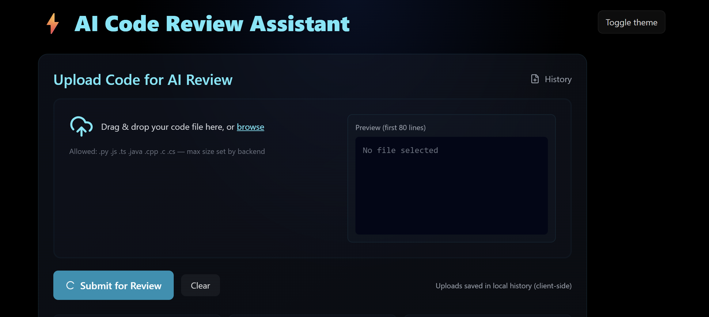
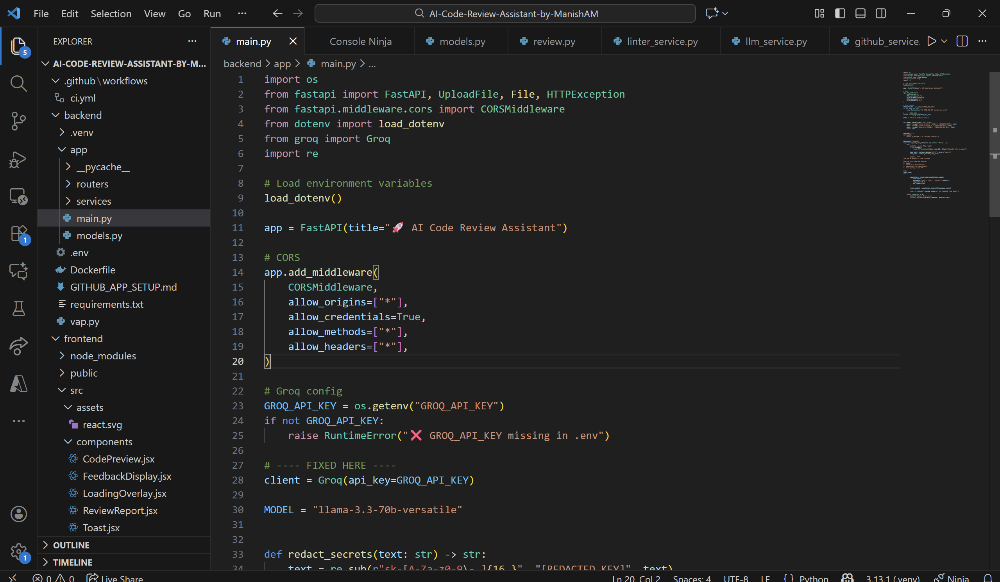
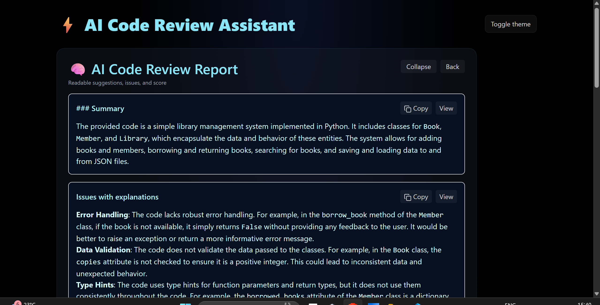
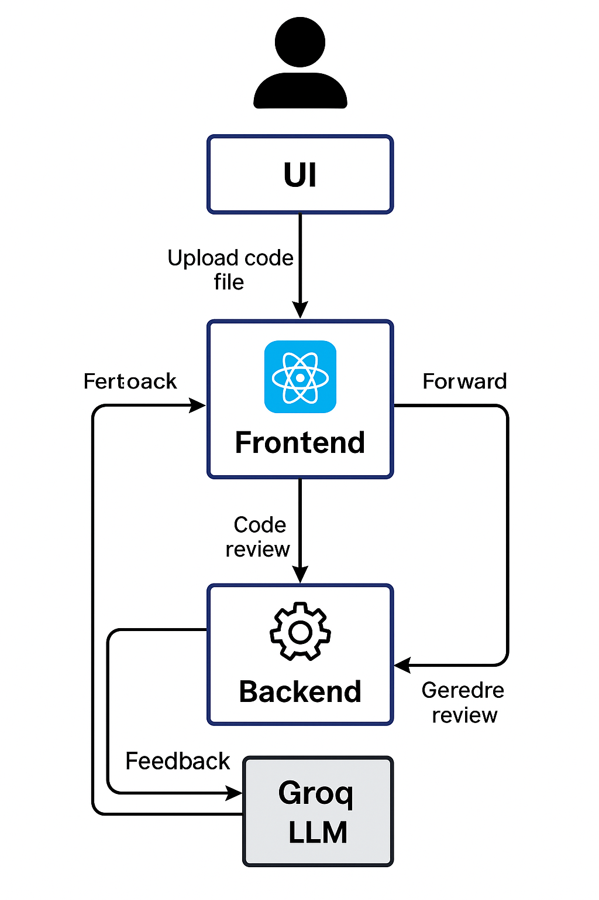

# AI Code Review Assistant by Manish A M

🚀 AI Code Review Assistant

A modern AI-powered tool that analyzes code, detects issues, and suggests improvements — built using FastAPI, React, Tailwind, Framer Motion & Groq LLM.

⭐ Overview
The AI Code Review Assistant allows developers to upload any source code file and instantly receive:
🔍 Code Summary
🐞 Bug Detection
🛡 Security & Performance Suggestions
🎨 Cleanliness & Style Feedback
📊 Code Quality Score (0–10)
Built with a fully responsive neon UI, drag-and-drop upload area, real-time animations, and a powerful backend powered by Groq’s Llama-3.3 70B model.

🏗 Tech Stack
Frontend
⚛️ React + Vite
🎨 TailwindCSS
🎭 Framer Motion animations
🔥 Modern neon-themed UI
📦 Lucide React Icons

Backend
🚀 FastAPI
🤖 Groq LLM (Llama-3.3-70B)
🔒 Secret redaction system
📁 File streaming + async handling

📸 Screenshots
🔷 Home UI

📤 Upload Form

🧠 AI Feedback Output

🏗 System Architecture

⚡ Features
🖱️ Modern Upload UI
Drag & drop
File type validation
Automatic secret key redaction

🧠 AI-Powered Code Review
Detects bugs, vulnerabilities & code smells
Gives line-by-line suggestions
Security, performance, structure & readability checks
Stable, deterministic results

🎨 Smooth UX
Neon blue theme
Motion animations
Responsive on all devices
